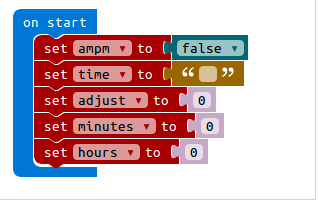

# Build your own micro:bit watch from an old pair of jeans and T-shirt

### Materials
 - micro:bit, battery holder and 2 AAA batteries
 - Old T-shirt
 - Old Jeans
 - Velcro with sticky back – 5cm x 5cm
 - Double-sided tape – 22cm x 5cm. You can find carpet tape in your local hardware shop
 - Ruler and pen
 - Scissors

### Additional coding activities
1. Countdown timer
2. Digital watch

### Digital Watch

**1. Step 1 - Create the time variables**

We need to make some variables to keep track of the time and for a few other things.
1. Go into Basic in the toolbox and pull an on start on to the workspace.
2. Ok, in Variables click on Make a Variable. Name the variable as hours. Drag out a set to block and change the name with the dropdown to hours. Place the variable into the on start block.
3. Repeat this 4 more times to make variables named minutes, time, adjust, and ampm.
4. Now, for the set to block for time, go to Text and drag a " " in and replace the 0.
5. For the ampm variable, change the 0 there to a false from the Logic catagory.

